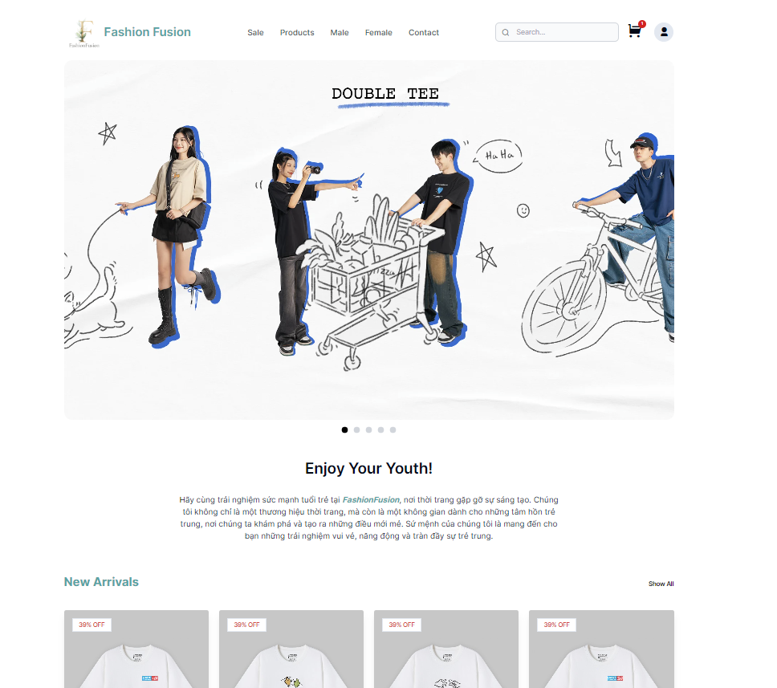
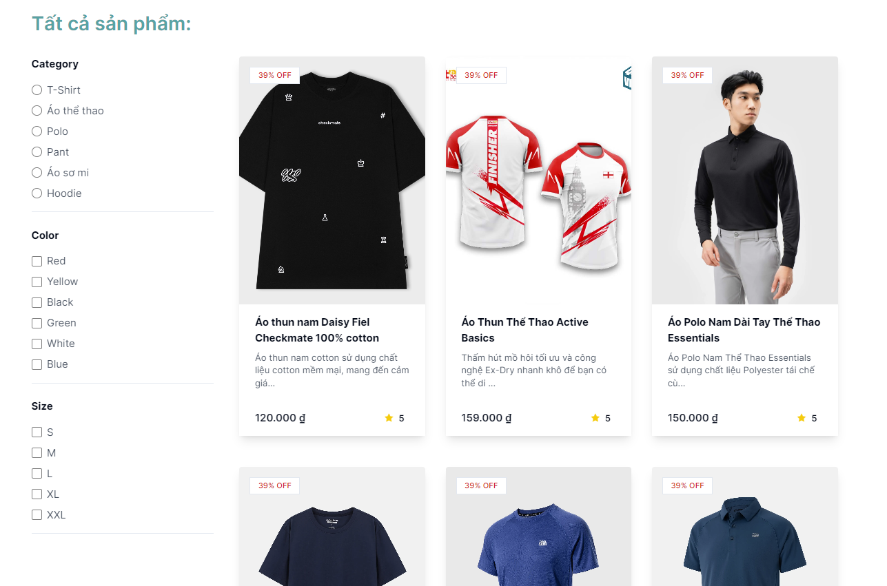
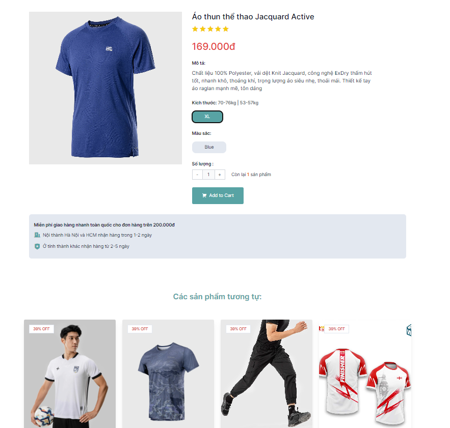
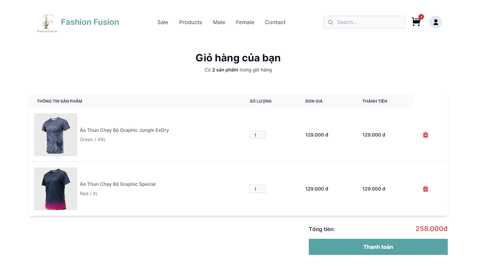
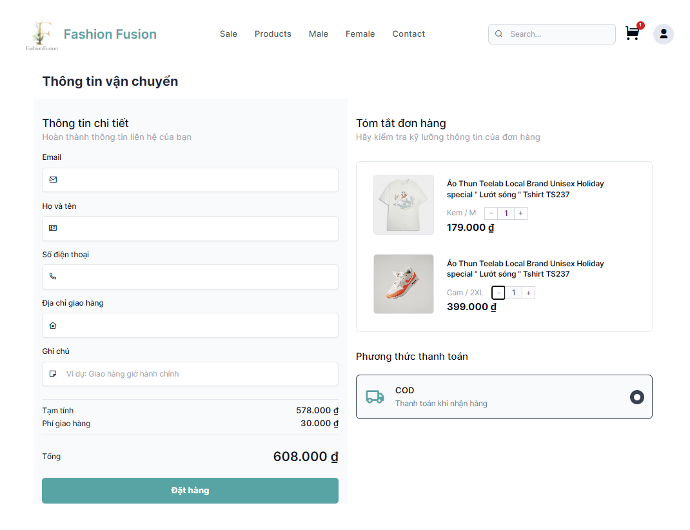
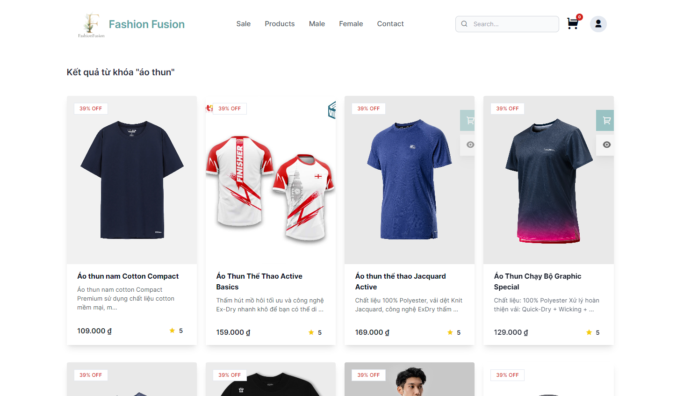
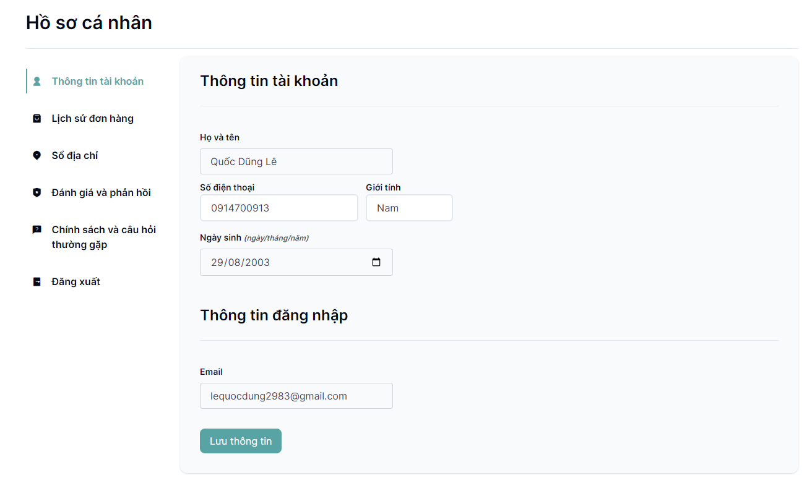
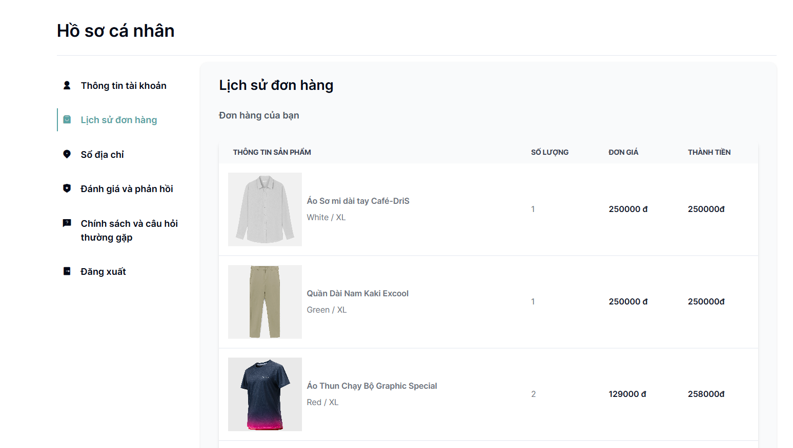

#  Fashion Fusion (Website for Client)
An Ecommerce store that integrates personalized product recommendations to help you find the perfect clothing items. With a wide range of trendy options available, we cater to diverse styles and preferences. 

## Features

- User-Friendly Interface.
- Diverse Range of Clothing Options.
- Product Recommendations.
- Regularly Updated Inventory.
- Detailed Product Descriptions and Size Charts.
- Add Products to the Shopping Cart
- Proceed to Checkout.
- Search Functionality.
- Filtering and Sorting via Categories, Colors, Sizes.
- Manage profile (included view Purchase History).
- Send reports/feedback to admin.

## Requirement
- Runtime environment:
    - Node.js 20.10.0+.
    - MongoDB for database storage.
    - Firebase Storage for file storage.
    - Vercel for hosting.

- Development environment:
    - Node.js 20.10.0+.
    - React.js 18.2.0+ for frontend development.
    - Tailwind CSS for styling.
    - MongoDB for database storage.
    - Firebase Storage for file storage.
      
## Installation Guide

To install and run the project locally, follow these steps:

1. Clone this repo.
2. Run `npm install` to install the dependencies.
3. Run `npm run dev` to start the server.

## User Guide

You can simply click this [link](https://rhythm-party.vercel.app/) to get started.

## User Interface

## Authors

[Lê Quốc Dũng](https://github.com/DungLe2983)

[Phạm Thanh Đồng ](https://github.com/ThanhDong00)

